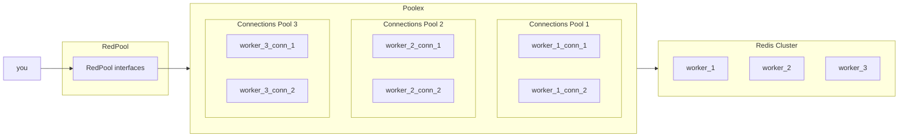

# How it works

It is a scheme of interaction with Redis through the RedPool library when the Redis cluster consists of three working nodes, and the library is configured so that two permanent connections are open for each node.

